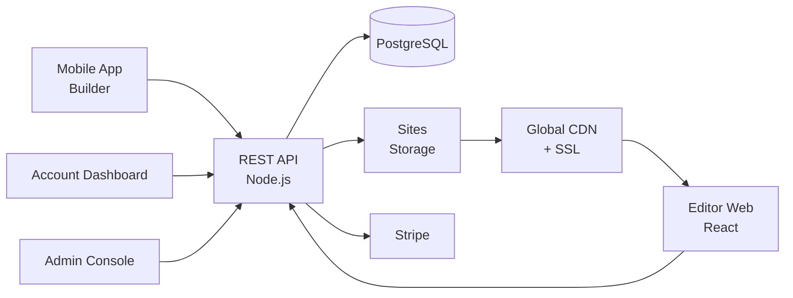

# Wix Clone — White-Label SaaS & No-Code Platform by Miracuves

**MXWix** is a production-ready, white-label Wix clone: a complete no-code website builder with drag-drop editor, hosting, and admin console — delivered with **100% source code ownership** in **6 working days**.

> 🧰 **See it running before you talk to anyone.** Live builder app, dashboard, and admin console — demo credentials are printed on the [solution page](https://miracuves.com/wix-clone#demo). No sales call required.

---

## 🚀 Live Demos

| Environment | URL | What you can test |
|---|---|---|
| 📱 Mobile Builder | [mas.mimeld.com](https://mas.mimeld.com) | Drag-drop blocks, preview, publish |
| 🌐 Editor Web | [mxwix.mimeld.com](https://mxwix.mimeld.com) | Full builder experience in browser |
| 👤 Account Dashboard | [Solution page → Demo](https://miracuves.com/wix-clone#demo) | Sites, billing, domains, analytics |
| 🛠️ Admin Console | [Solution page → Demo](https://miracuves.com/wix-clone#demo) | Users, plans, templates, abuse, analytics |

Demo credentials for all environments: **[miracuves.com/wix-clone → Demo section](https://miracuves.com/wix-clone/#demo)**

---

## ✨ What Makes This Wix Clone Different

Most website builders stop at "templates." This platform ships with the features that actually run a no-code SaaS *business*:

- **Drag-Drop Visual Editor** — pixel-perfect editor with mobile/tablet/desktop breakpoints — what made Wix & Squarespace mainstream
- **Built-In Hosting + SSL** — one-click publishing with custom domain, free SSL, and global CDN — what every no-code builder must have
- **AI Site Generator** — prompt → full site in 30s, then user customizes — Wix's latest growth lever
- **App Marketplace** — e-commerce, booking, blog, forms, payments, CRM apps — what makes builders extensible
- **White-Label for Agencies** — agencies can resell under their own brand with markup — millions of small agencies are the channel

## 📦 Core Features

**User/Customer:** drag-drop builder · templates · mobile preview · custom domain · SSL · analytics · forms & payments · SEO tools

**Partner/Agency:** white-label accounts · client management · bulk site management · billing · commission engine

**Admin:** user management · template marketplace · plan & feature flags · abuse moderation · analytics

## 🏗️ Architecture

**Stack:** React for editor · Node.js backend · PostgreSQL · S3 + CDN for hosting · Stripe for billing · Stripe, regional gateways, multi-currency, partner payouts

## 📋 What’s Included

- ✅ Full source code — backend, web, mobile apps, panels (no encryption, no license locks)
- ✅ Deployment to your servers & app store submission assistance
- ✅ Your branding — white-label rename, logo, colors, domain
- ✅ 60 days post-launch support + 12 months of free updates
- ✅ Documentation & handover

**Pricing:** from **$2,899**, transparent on the [solution page](https://miracuves.com/wix-clone/#pricing) — no "contact us for quote" games.

## 🆚 Why Not Build From Scratch?

Custom website builders run $200k–$1.5M and 12–24 months. A proven white-label base gets you to market in 6 working days for a fraction of that, with your budget preserved for templates, marketing, and hosting margins.

## 📚 Resources

- 📖 [Wix Clone — Full Solution Page](https://miracuves.com/wix-clone) (features, pricing, demos, FAQ)
- 💰 [How Much Does a Website Builder Cost in 2026?](https://miracuves.com/wix-clone#pricing) pricing breakdown & what's included
- 📝 [Best Wix Clone Script in 2026](https://miracuves.com/wix-clone/blog/) features, pricing & launch guide
- 🧠 [White-Label Builders: The Agency Channel That Scales](https://miracuves.com/wix-clone/blog/) partner economics, reseller margins
- ✅ [Miracuves Facts & Claims Ledger](https://miracuves.com/wix-clone/facts/) every claim we make, verified

## 🏢 About Miracuves

[Miracuves Solutions](https://miracuves.com) builds white-label clone apps and custom software from Mumbai, India — 90+ ready-made solutions, live demos for every product, transparent pricing, and delivery in 6 working days. Operating since 2010.

**Talk to us:** [WhatsApp](https://wa.me/919830009649) · [Schedule a consultation](https://miracuves.com/schedule-consultation/) · [miracuves.com](https://miracuves.com)

---

### ⚠️ Note on This Repository

This repository is a product overview. The full source code is delivered to clients on purchase — see [what’s included](https://miracuves.com/wix-clone/#included). For a hands-on evaluation, use the live demos above; credentials are public on the solution page.

*Keywords: wix clone, wix clone script, website builder, no-code, white label Wix, drag-drop editor, Flutter no-code, Node.js SaaS*

---

<!--
══════════════════════════════════════════════════
TEMPLATE VARIABLE KEY — auto-generated from Netflix-Clone pattern
══════════════════════════════════════════════════
{APP_NAME}        Wix Clone
{MX_NAME}         MXWix
{CATEGORY}        SaaS & No-Code Platform
{DEMO_WEB}        mxwix.mimeld.com
{PRICE}           $2,899
{SLUG}            wix-clone
{SOLUTION_URL}    https://miracuves.com/wix-clone/
{VERTICAL}        saas_no_code

See /tmp/verticals/saas_no_code.txt for the vertical config used to generate this README.
══════════════════════════════════════════════════
-->